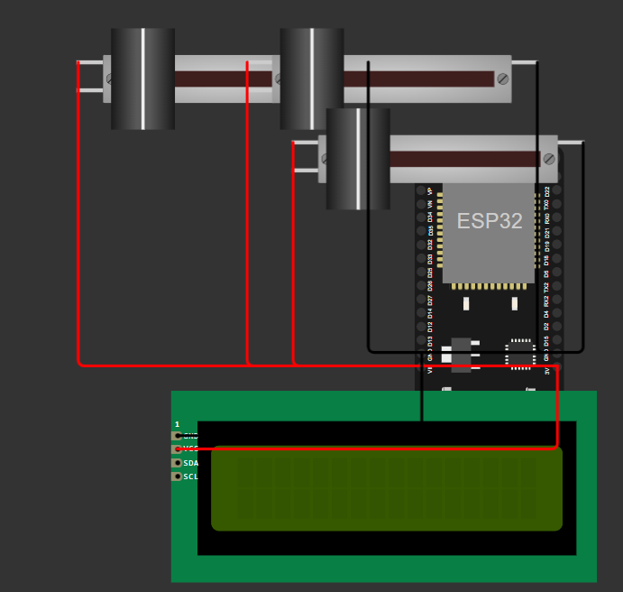

<p align="center">
  
</p>

# [SILENT SPOT] 🎯

## Basic Details

### Team Name: [GENESIS HACK]

### Team Members
- Member 1: [ATHIRA M] - [RAJIV GANDHI INSTITUTE OF TECHNOLOGY]
- Member 2: [KEERTHANA ROSE TONY] - [RAJIV GANDHI INSTITUTE OF TECHNOLOGY]

### Hosted Project Link
[mention your project hosted link here]

### Project Description
[An IoT-based system that monitors noise levels across three different areas in real-time using ESP32 microcontrollers and noise sensors. The system continuously collects sound data (30-100 dB), processes it, and uploads readings every 2 seconds to a Supabase cloud database. Users can access a web dashboard that displays live noise levels with color-coded indicators and automatically recommends the quietest available space. The solution helps students, remote workers, and facility managers quickly find peaceful environments without wasting time searching. Built with ESP32 hardware, Supabase backend, and a React-based frontend for seamless real-time monitoring and data visualization.]

### The Problem statement
[In campus and hostel environments, fluctuating noise levels negatively impact students' concentration and academic performance. Currently, there is no cost-effective and scalable system to monitor, classify, and identify optimal low-noise zones in real time. This creates a need for an intelligent acoustic monitoring solution.]

### The Solution
[This project is a real-time noise monitoring system designed to identify low and high noise zones within a college campus or hostel environment.

The system uses an ESP32 DevKit V1 microcontroller connected to multiple sound sensors placed in different areas. Each sensor continuously measures ambient sound levels and sends analog data to the ESP32.

The ESP32:
Reads sound intensity from each area
Compares noise levels
Identifies the quietest zone
Displays real-time results on a 16x2 I2C LCD

The solution is scalable and can be extended by:
Connecting to Wi-Fi
Sending data to cloud platforms
Creating a web or mobile dashboard for live monitoring

This system helps maintain a peaceful academic environment by identifying noise-prone areas and promoting awareness.]

---

## Technical Details

### Technologies/Components Used

**For Software:**
- Languages used: [HTML,CSS,JAVA SCRIPT,C++]
- Frameworks used: [Arduino Framework for ESP32]
- Libraries used: [WiFi.h,LiquidCrystal_12C.h]
- Tools used: [Wokwi Stimulator,Arduino IDE,Supabase]

**For Hardware:**
- Main components: [ESP32 DevKit V1,Sound sensor module,Power supply,Connecting Wires,LCD Display]
- Specifications: [ESP32,SOUND SENSOR,LCD Display]
- Tools required: [Breadboard,Jumper Wires,USB Cble,Laptop with Arduino IDE]

---

## Features

List the key features of your project:
- Feature 1: [Multi-Area Noise Monitoring]
- Feature 2: [Real-Time Noise Detection]
- Feature 3: [WiFi Based Data Transmission]
- Feature 4: [Live LCD Display]

---

## Implementation

### For Software:

#### Installation
```bash
[Installation commands - e.g., npm install, pip install -r requirements.txt]
```

#### Run
```bash
[Run commands - e.g., npm start, python app.py]
```

### For Hardware:

#### Components Required
[ESP32 DevKit V1 (WiFi mirocontroller,240MHz,12-bit ADC)
3Sound Sensors(Analog Output,3.3-5V)
16*2 12C LCD(SDA-21,SCL-22
BreadBoard & Jumper Wires
5 USB Power Supply]

#### Circuit Setup
[Component      ESP32 PIN
Sensor1 OUT     GPIO 36
Sensor2 OUT     GPIO 39
Sensor3 OUT     GPIO 34
LCD SDA         GPIO 21
LCD SCL         GPIO 22
AII VCC         3.3V
AII GND         GND]

---

## Project Documentation

### For Software:

#### Screenshots (Add at least 3)


*Add caption explaining what this shows*


*Add caption explaining what this shows*


*Add caption explaining what this shows*

#### Diagrams

**System Architecture:**


*Explain your system architecture - components, data flow, tech stack interaction*

**Application Workflow:**


*Add caption explaining your workflow*

---

### For Hardware:

#### Schematic & Circuit

 https://drive.google.com/file/d/1jQrOSvdSJgMJ674f8oXfnChGkEdXifDW/view?usp=drive_link
The system is built using an ESP32 DevKit V1 as the main controller. Three sound sensors are connected to the analog input pins (GPIO 36, 39, and 34) to measure noise levels from different areas. Each sensor is powered using the 3.3V and GND pins of the ESP32.
A 16x2 LCD with I2C module is connected to display real-time noise data. The LCD uses GPIO 21 (SDA) and GPIO 22 (SCL) for communication, along with 3.3V and GND for power.
All components share a common ground to ensure stable readings. The ESP32 processes the analog values from the sensors and displays the identified noise levels on the LCD.


*Add caption explaining the schematic*

#### Build Photos


*List out all components shown*


*Explain the build steps*


*Explain the final build*

---

## Additional Documentation

### For Web Projects with Backend:

#### API Documentation

**Base URL:** `https://api.yourproject.com`

##### Endpoints

**GET /api/endpoint**
- **Description:** [What it does]
- **Parameters:**
  - `param1` (string): [Description]
  - `param2` (integer): [Description]
- **Response:**
```json
{
  "status": "success",
  "data": {}
}
```

**POST /api/endpoint**
- **Description:** [What it does]
- **Request Body:**
```json
{
  "field1": "value1",
  "field2": "value2"
}
```
- **Response:**
```json
{
  "status": "success",
  "message": "Operation completed"
}
```

[Add more endpoints as needed...]

---

### For Mobile Apps:

#### App Flow Diagram


*Explain the user flow through your application*

#### Installation Guide

**For Android (APK):**
1. Download the APK from [Release Link]
2. Enable "Install from Unknown Sources" in your device settings:
   - Go to Settings > Security
   - Enable "Unknown Sources"
3. Open the downloaded APK file
4. Follow the installation prompts
5. Open the app and enjoy!

**For iOS (IPA) - TestFlight:**
1. Download TestFlight from the App Store
2. Open this TestFlight link: [Your TestFlight Link]
3. Click "Install" or "Accept"
4. Wait for the app to install
5. Open the app from your home screen

**Building from Source:**
```bash
# For Android
flutter build apk
# or
./gradlew assembleDebug

# For iOS
flutter build ios
# or
xcodebuild -workspace App.xcworkspace -scheme App -configuration Debug
```

---

### For Hardware Projects:

#### Bill of Materials (BOM)

| Component | Quantity | Specifications | Price | Link/Source |
|-----------|----------|----------------|-------|-------------|
| ESP32 Dev Board | 1 | WiFi +Bluetooth,240MHz,3.3V | 400-600/- | [Link] |
| Sound Sensor Module  | 3 | Analog Output 3.3V Compactable | 300-450/- | [Link] |
| 16*2 LCD Display(I2C) | 1 | 5V/3.3V Compactable,I2C Interface | 150-250/- | [Link] |
| Breadboard | 1 | 830 tiepoints | 100/- | [Link] |
| Jumper Wires | 15 | Male-to-Male | 50/- | [Link] |
| USB Cable | 1 | For Powering ESP32 | 100-150/- | |

**Total Estimated Cost:** [1100-1600/-]

#### Assembly Instructions

Step 1: Prepare the Workspace
1.Place the breadboard on a flat surface.
2.Mount the ESP32 DevKit V1 on one side of the breadboard.
3.Ensure the ESP32 is not powered while wiring.

Step 2: Power Connections
1.Connect ESP32 3.3V pin to the breadboard positive rail.
2.Connect ESP32 GND pin to the breadboard negative rail.

Step 3: Connect Sound Sensor – Area 1
1.Each sound sensor module has 3 pins: VCC, GND, OUT
2.VCC → Breadboard + rail (3.3V)
3.GND → Breadboard – rail (GND)
4.OUT → GPIO 36 of ESP32

Step 4: Connect Sound Sensor – Area 2
1.VCC → 3.3V rail
2.GND → GND rail
3.OUT → GPIO 39

Step 5: Connect Sound Sensor – Area 3
1.VCC → 3.3V rail
2.GND → GND rail
3.OUT → GPIO 34

Step 6: Connect 16x2 LCD (I2C Module)
1.The I2C LCD has 4 pins: VCC, GND, SDA, SCL
2.VCC → 3.3V rail
3.GND → GND rail
4.SDA → GPIO 21
5.SCL → GPIO 22
These are default I2C pins of ESP32.

Step 7: Final Connection Check
✔ All VCC lines connected to 3.3V
✔ All GND lines connected together
✔ Sensor OUT pins connected correctly
✔ LCD SDA → 21
✔ LCD SCL → 22

Step 8: Power the System
1.Connect ESP32 to laptop using USB cable.
2.Upload the code via Arduino IDE.
3.Open Serial Monitor to verify readings.

---

### For Scripts/CLI Tools:

#### Command Reference

**Basic Usage:**
```bash
python script.py [options] [arguments]
```

**Available Commands:**
- `command1 [args]` - Description of what command1 does
- `command2 [args]` - Description of what command2 does
- `command3 [args]` - Description of what command3 does

**Options:**
- `-h, --help` - Show help message and exit
- `-v, --verbose` - Enable verbose output
- `-o, --output FILE` - Specify output file path
- `-c, --config FILE` - Specify configuration file
- `--version` - Show version information

**Examples:**

```bash
# Example 1: Basic usage
python script.py input.txt

# Example 2: With verbose output
python script.py -v input.txt

# Example 3: Specify output file
python script.py -o output.txt input.txt

# Example 4: Using configuration
python script.py -c config.json --verbose input.txt
```

#### Demo Output

**Example 1: Basic Processing**

**Input:**
```
This is a sample input file
with multiple lines of text
for demonstration purposes
```

**Command:**
```bash
python script.py sample.txt
```

**Output:**
```
Processing: sample.txt
Lines processed: 3
Characters counted: 86
Status: Success
Output saved to: output.txt
```

**Example 2: Advanced Usage**

**Input:**
```json
{
  "name": "test",
  "value": 123
}
```

**Command:**
```bash
python script.py -v --format json data.json
```

**Output:**
```
[VERBOSE] Loading configuration...
[VERBOSE] Parsing JSON input...
[VERBOSE] Processing data...
{
  "status": "success",
  "processed": true,
  "result": {
    "name": "test",
    "value": 123,
    "timestamp": "2024-02-07T10:30:00"
  }
}
[VERBOSE] Operation completed in 0.23s
```

---

## Project Demo

### Video
[Add your demo video link here - YouTube, Google Drive, etc.]

*Explain what the video demonstrates - key features, user flow, technical highlights*

### Additional Demos
[Add any extra demo materials/links - Live site, APK download, online demo, etc.]

---

## AI Tools Used (Optional - For Transparency Bonus)

If you used AI tools during development, document them here for transparency:

**Tool Used:** [e.g., GitHub Copilot, v0.dev, Cursor, ChatGPT, Claude]

**Purpose:** [What you used it for]
- Example: "Generated boilerplate React components"
- Example: "Debugging assistance for async functions"
- Example: "Code review and optimization suggestions"

**Key Prompts Used:**
- "Create a REST API endpoint for user authentication"
- "Debug this async function that's causing race conditions"
- "Optimize this database query for better performance"

**Percentage of AI-generated code:** [Approximately X%]

**Human Contributions:**
- Architecture design and planning
- Custom business logic implementation
- Integration and testing
- UI/UX design decisions

*Note: Proper documentation of AI usage demonstrates transparency and earns bonus points in evaluation!*

---

## Team Contributions

- [Name 1]: [Specific contributions - e.g., Frontend development, API integration, etc.]
- [Name 2]: [Specific contributions - e.g., Backend development, Database design, etc.]
- [Name 3]: [Specific contributions - e.g., UI/UX design, Testing, Documentation, etc.]

---

## License

This project is licensed under the [LICENSE_NAME] License - see the [LICENSE](LICENSE) file for details.

**Common License Options:**
- MIT License (Permissive, widely used)
- Apache 2.0 (Permissive with patent grant)
- GPL v3 (Copyleft, requires derivative works to be open source)

---

Made with ❤️ at TinkerHub
